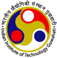

## Undergrad

### Indian Institute of Technology Guwahati

**Bachelors in Electronics and Communication Engineering** (Nov '21 - Present): Grade: 8.65/10

**Minor in Computer Science and Engineering** (Jul '22 - Present): Grade: 9.00/10

Positions of Responsibility:
* JAM Head, Debating Society IIT Guwahati
* Core Team, [Coding Club IIT Guwahati](https://codingiitg.github.io/)
* Student Mentor, Cepstrum
* Manager, Udgam-23, IIT Guwahati

