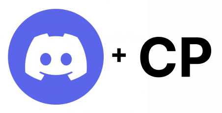

## Key Projects

### Quantum Powered Business Rule Engine

Group project, <strong>Gold Medal</strong>, Inter IIT Tech Meet 12.0

[[*Drive*]](https://bit.ly/3tCRDCf)

Made a robust business rule
engine, which re-accomodates passengers whose flights have been disrupted due to various reasons by using **Quantum Computing**. The designed engine exhibits a high degree of flexibility, accommodating dynamic rule changes and adjustments to penalties, as may be necessitated by end-users, typically within the context of an airline operation.

### Competitive Programming Helper Discord Bot

Group project, CP Module 2022

[[*Github*]](https://github.com/Sparsh752/TLE_Python)

In this bot, we focussed to make the user experience more enthralling on various judges (we have also added functionalities for [AtCoder](https://atcoder.jp/), something which was never done before) by keeping track of various statistics of each user such as number of questions solved, most difficult questions solved, performance in each contest, and graphs related to all these metrics. Also, two different users can challenge each other to a CP duel using our bot. Also, this bot can be used for practicing on the judges as the bot recommends questions to each user according to his/her rating and also recommends the perfect contests on which the user can perform a virtual contest to enhance his/her CP skills.

### Database in C

Self Project

[[*Github*]](https://github.com/g-s01/db-in-c)

In this project, I am trying to understand how a real database management system works. Till now, I have made the basic memory architecture of the system based on [B+ tree](https://en.wikipedia.org/wiki/B%2B_tree). The database currently supports insertion and selection of entries.

## Key Course Projects

### Socket based Chat System

([Computer Networks Lab](https://www.iitg.ac.in/cse/CS342))

[[*Github*]](https://github.com/g-s01/CS342-2023/tree/main/Lab-2/Solution/Q3)

In this application, I have implemented a one server-multiple client TCP socket based program from scratch. This program supports graceful exit of servers and clients, message broadcasts, and private communication between clients. 

### Eight puzzle solver

([System Software Lab](https://www.iitg.ac.in/cse/CS242))

[[*Github*]](https://github.com/g-s01/CS242_LabWork/tree/main/Lab_3/Assignment_2)

In this program, I attempted to solve the famous [8 puzzle problem](http://gamescrafters.berkeley.edu/site-legacy-archive-sp20/games.php?puzzle=8puzzle) deterministically. To solve the problem, I employed the [A* algorithm](https://en.wikipedia.org/wiki/A*_search_algorithm) on the Manhattan distance between the cells. This program can easily be extended to solve similar higher problems such as 15-puzzle, 24-puzzle etc.